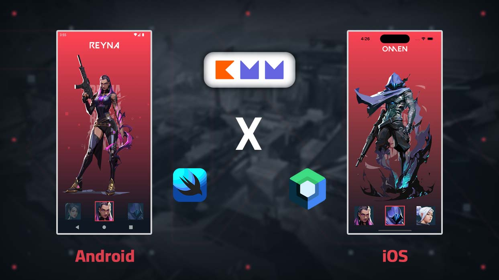

<h1 align="center">AgentX</h1>

<p align="center">  
An Android & iOS app consuming a [Valorant Game](https://valorant-api.com/) API to display agent list. it has been built with Kotlin Multiplatform Mobile (KMM), Repository Pattern and MVVM pattern as well as Architecture Components. 
</p>
<p align="center">

</p>

<br/>


Here's a video of how it looks.

https://github.com/Musfick/AgentX/assets/43013838/983b6c83-4f2a-4545-b9ee-1e7cf741ba84

## Tech stack & Open-source libraries
- 100% [Kotlin](https://kotlinlang.org/) based, [Coroutines](https://github.com/Kotlin/kotlinx.coroutines) + [Flow](https://kotlin.github.io/kotlinx.coroutines/kotlinx-coroutines-core/kotlinx.coroutines.flow/) for asynchronous.
- Jetpack Compose (Android UI)
- SwiftUI (iOS UI)
- Ktor for networking
- SQLDelight for offline caching
- Coil(Android) & Kingfisher(iOS) for image loading

## Architecture
- (View -> ViewModel -> Usecase -> Repository -> Datasource)
- Usecase
- Repository pattern
- Single source of truth
- Offline caching

## Shared
- Datasource
- Repository
- Usecase
- UiState(Loading, Success, Error)

## Download APK
https://github.com/Musfick/AgentX/blob/master/androidApp-debug.apk

## Todo
- add koin for dependency injection
- add shared coroutine scope
- shared everything except ui
- improve iOS animation
- add testing :/
- improve architecture

## Tools
- XCode Version 14.1
- Android Studio Hedgehog | 2023.1.1 Canary 7

## Contributors
Feel free to contribute in any way to the project from typos in docs to code review are all welcome.

## License

 ```
   Copyright 2023 Musfick Jamil
   
   Licensed under the Apache License, Version 2.0 (the "License");
   you may not use this file except in compliance with the License.
   You may obtain a copy of the License at

       http://www.apache.org/licenses/LICENSE-2.0

   Unless required by applicable law or agreed to in writing, software
   distributed under the License is distributed on an "AS IS" BASIS,
   WITHOUT WARRANTIES OR CONDITIONS OF ANY KIND, either express or implied.
   See the License for the specific language governing permissions and
   limitations under the License.
 ```
